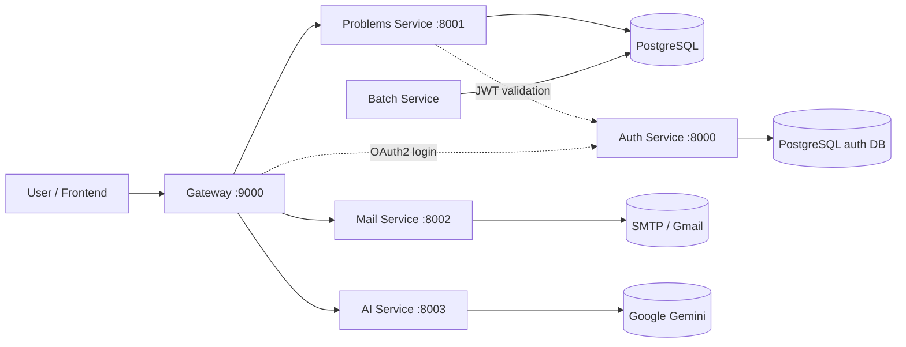

# Leet Journal
# GSSOC'26 contributors [read this first](https://github.com/hardikxk/leet-journal/discussions/30#discussion-10072805)


Leet Journal is a Spring Boot microservices project for tracking LeetCode progress, managing problem metadata, authenticating users, sending mail, and experimenting with AI-assisted problem solving.

## Overview

The repository is organized as a set of independently runnable services:

- `auth` handles authentication and authorization server concerns.
- `gateway` is the public entry point and forwards requests to backend services.
- `problems-service` serves problem data and execution endpoints.
- `batch-service` is responsible for batch ingestion and scheduled-style processing.
- `mail-service` sends MIME email notifications.
- `ai-service` streams AI responses for DSA help.

## Architecture

The system follows a gateway-first microservice layout.



### Request flow

- The client talks to `gateway` on port `9000`.
- `gateway` relays authenticated requests to the downstream services.
- `/problems/**` and `/code/**` are forwarded to `problems-service` on port `8001`.
- `/mail/**` is forwarded to `mail-service` on port `8002`.
- `/ai/**` is forwarded to `ai-service` on port `8003`.
- `auth` runs on port `8000` and issues tokens consumed by the other services.

### Service responsibilities

- `auth` provides the OAuth2 authorization server and persists identity data in PostgreSQL.
- `problems-service` exposes endpoints for listing problems, fetching a problem by id, checking the current authenticated user, and running code locally.
- `batch-service` loads problem data from CSV and stores it in the database.
- `mail-service` sends email notifications using SMTP.
- `ai-service` wraps the Google GenAI client and streams chat-style responses.

## Repository Layout

Each service is a standalone Maven project:

- `auth/`
- `gateway/`
- `problems-service/`
- `batch-service/`
- `mail-service/`
- `ai-service/`

The services are intentionally separate so they can be developed, tested, and deployed independently.

## Prerequisites

- Java 25
- Maven Wrapper or Maven
- PostgreSQL
- SMTP credentials for mail delivery
- Google GenAI API key for the AI service

## Project Version

The current repository version is tracked in the root `VERSION` file.

## Configuration

Common local defaults are defined in each service’s `application.yml` or `application.yaml` file.

Environment variables used by the project include:

- `GMAIL_MAIL_USERNAME`
- `GMAIL_MAIL_PASSWORD`
- `GOOGLE_GENAI_API_KEY`
- `AUTH_SERVER_URI` for overriding the auth server location used by the gateway

PostgreSQL connection defaults used by the services point to `jdbc:postgresql://localhost:5432/db` with the username `user` and password `pass`.

## Running Locally
You will need a PostgreSQL database running for the application. Best way to do this is to run a container using Docker / Podman and configuring your environment variables. By default the application expects the container on port 5432 with the following config:
Database name -> db
Username -> user
Password -> pass


Start the services in this order (to prevent unnecessary errors):

1. PostgreSQL Database (container or locally)
2. `auth`
3. `problems-service`
4. `mail-service`
5. `ai-service`
6. `gateway`
7. `batch-service` - only if you want to import data or run batch jobs

Use the Maven Wrapper from each service directory, for example:

```bash
cd auth
./mvnw spring-boot:run
```

Repeat the same pattern for the other services.

## API Documentation

This section documents the HTTP API exposed by Leet Journal. All client traffic should go through the **Gateway** (`http://localhost:9000`), which routes requests to the appropriate downstream service and validates authentication where required.

> Some request/response payload shapes below are illustrative — verify exact field names against the relevant service's controllers/DTOs before relying on them in client code, and update this section alongside any API changes.

### Service-wise Route Summary

| Service | Port | Base Path (via Gateway) | Purpose |
|---|---|---|---|
| Gateway | 9000 | `/` | Public entry point, routes requests, validates OAuth2 tokens |
| Auth | 8000 | `/oauth2/**`, `/login/**` | OAuth2 authorization server, issues tokens |
| Problems Service | 8001 | `/problems/**`, `/code/**` | Problem metadata, current-user check, code execution |
| Mail Service | 8002 | `/mail/**` | MIME email notifications via SMTP |
| AI Service | 8003 | `/ai/**` | Streams AI chat responses for DSA help (Google Gemini) |
| Batch Service | — (no gateway route) | — | CSV ingestion into PostgreSQL, run standalone |

All client requests should target the gateway (`http://localhost:9000`) rather than calling backend services directly, so that authentication and routing behave consistently.

### Authentication Guide

Leet Journal uses an OAuth2 authorization server (the `auth` service) to issue tokens that protected routes on other services validate.

**1. Obtaining a token**

1. Direct the user (or your OAuth2 client) to the authorization endpoint on the `auth` service (default `http://localhost:8000`), or through the gateway if `AUTH_SERVER_URI` routing is configured.
2. Complete the login/consent flow.
3. Exchange the resulting authorization code for an access token at the token endpoint, or use the `client_credentials` grant for service-to-service calls if configured.

```bash
curl -X POST http://localhost:8000/oauth2/token \
  -H "Content-Type: application/x-www-form-urlencoded" \
  -d "grant_type=client_credentials" \
  -d "client_id=YOUR_CLIENT_ID" \
  -d "client_secret=YOUR_CLIENT_SECRET"
```

A successful response returns a JSON body containing an `access_token`, `token_type`, and `expires_in`.

**2. Using the token**

Include the access token as a Bearer token on the `Authorization` header for any protected request routed through the gateway:

```
Authorization: Bearer <access_token>
```

```bash
curl http://localhost:9000/problems/all \
  -H "Authorization: Bearer <access_token>"
```

**3. Token validation**

Downstream services (e.g. `problems-service`) validate the JWT against the `auth` service. If `AUTH_SERVER_URI` is set, the gateway and resource servers use it to override the default auth server location — useful when running in containers or non-default hosts.

### Auth Service

Base URL (direct): `http://localhost:8000`

| Method | Endpoint | Description |
|---|---|---|
| GET | `/oauth2/authorize` | Starts the OAuth2 authorization code flow |
| POST | `/oauth2/token` | Exchanges an authorization code (or client credentials) for an access token |
| POST | `/oauth2/revoke` | Revokes a previously issued token |
| GET | `/oauth2/jwks` | Publishes the JSON Web Key Set used to verify issued JWTs |
| GET | `/login` | Login page / endpoint for the authorization code flow |

> These are the conventional Spring Authorization Server endpoint names. Confirm against `auth/src/main/java` configuration if your client library needs exact paths.

### Problems Service

Base URL (via gateway): `http://localhost:9000`
Base URL (direct): `http://localhost:8001`

**List all problems**

```
GET /problems/all
```

Auth required: Yes (Bearer token). Returns the full list of problems currently stored in the database.

```bash
curl http://localhost:9000/problems/all \
  -H "Authorization: Bearer <access_token>"
```

Sample response:

```json
[
  { "id": 1, "title": "Two Sum", "difficulty": "Easy", "tags": ["Array", "Hash Table"] },
  { "id": 2, "title": "Add Two Numbers", "difficulty": "Medium", "tags": ["Linked List", "Math"] }
]
```

**Find a problem by id**

```
GET /problems/find/{id}
```

Auth required: Yes (Bearer token).

| Path param | Type | Description |
|---|---|---|
| `id` | integer | The problem's unique identifier |

```bash
curl http://localhost:9000/problems/find/1 \
  -H "Authorization: Bearer <access_token>"
```

Sample response:

```json
{
  "id": 1,
  "title": "Two Sum",
  "difficulty": "Easy",
  "description": "Given an array of integers...",
  "tags": ["Array", "Hash Table"]
}
```

**Run code**

```
GET /code/run
```

Auth required: Yes (Bearer token). Executes submitted code locally against the problems-service runtime.

```bash
curl "http://localhost:9000/code/run" \
  -H "Authorization: Bearer <access_token>"
```

> The exact query parameters or request body expected for code execution (e.g. source code, language, problem id, stdin) are not fully documented yet. Check the `problems-service` controller for the authoritative contract and update this section accordingly.

### Mail Service

Base URL (via gateway): `http://localhost:9000`
Base URL (direct): `http://localhost:8002`

**Send a MIME email**

```
GET /mail/mime
```

Auth required: Recommended (Bearer token), to prevent open relay abuse.

| Query param | Type | Required | Description |
|---|---|---|---|
| `to` | string | Yes | Recipient email address |
| `subject` | string | Yes | Email subject line |
| `text` | string | Yes | Email body content |

```bash
curl "http://localhost:9000/mail/mime?to=user@example.com&subject=Hello&text=This%20is%20a%20test%20email" \
  -H "Authorization: Bearer <access_token>"
```

Sample response:

```json
{ "status": "sent", "to": "user@example.com" }
```

> Mail delivery requires `GMAIL_MAIL_USERNAME` and `GMAIL_MAIL_PASSWORD` to be configured as environment variables on `mail-service`.

### AI Service

Base URL (via gateway): `http://localhost:9000`
Base URL (direct): `http://localhost:8003`

**Chat with the AI assistant**

```
GET /ai/chat
```

Auth required: Yes (Bearer token).

| Query param | Type | Required | Description |
|---|---|---|---|
| `prompt` | string | Yes | The user's DSA-related question or prompt |

Streams a chat-style response from Google Gemini via the Spring AI / Google GenAI client.

```bash
curl "http://localhost:9000/ai/chat?prompt=Explain%20binary%20search" \
  -H "Authorization: Bearer <access_token>"
```

The response is streamed as the model generates tokens, rather than returned as a single JSON payload. A typical client should consume it as a text/event-stream or chunked response.

> Requires `GOOGLE_GENAI_API_KEY` to be configured as an environment variable on `ai-service`.

### Gateway Routes

| Path Prefix | Forwarded To | Service Port |
|---|---|---|
| `/problems/**` | Problems Service | 8001 |
| `/code/**` | Problems Service | 8001 |
| `/mail/**` | Mail Service | 8002 |
| `/ai/**` | AI Service | 8003 |
| OAuth2 login / token validation | Auth Service | 8000 |

The gateway performs OAuth2 login and JWT validation against the `auth` service before relaying authenticated requests downstream. If `AUTH_SERVER_URI` is set, the gateway uses that value to locate the auth server instead of the default.

### Testing Examples

```bash
# 1. Get an access token (client credentials example)
TOKEN=$(curl -s -X POST http://localhost:8000/oauth2/token \
  -d "grant_type=client_credentials" \
  -d "client_id=YOUR_CLIENT_ID" \
  -d "client_secret=YOUR_CLIENT_SECRET" \
  | jq -r .access_token)

# 2. List all problems
curl http://localhost:9000/problems/all \
  -H "Authorization: Bearer $TOKEN"

# 3. Fetch a single problem
curl http://localhost:9000/problems/find/1 \
  -H "Authorization: Bearer $TOKEN"

# 4. Send a test email
curl "http://localhost:9000/mail/mime?to=test@example.com&subject=Hi&text=Hello" \
  -H "Authorization: Bearer $TOKEN"

# 5. Ask the AI assistant a question
curl "http://localhost:9000/ai/chat?prompt=What%20is%20dynamic%20programming" \
  -H "Authorization: Bearer $TOKEN"
```

A Postman collection is not yet included in this repository. Contributors are welcome to add one (e.g. `postman/leet-journal.postman_collection.json`) that mirrors the endpoints above, with an environment file for `baseUrl`, `authUrl`, and token variables.

## Developer Documentation

- [Contributing Guide](CONTRIBUTING.md)
- [Project Setup Guide](SETUP.md)

## Project Status
This project is under active development and is intended to grow as an open source learning platform for LeetCode practice and DSA tooling.
Contributions are welcome. If you are planning a larger change, open an issue first so the approach can be aligned before implementation.

### What I look for

- Small, reviewable pull requests.
- Clear commit messages and PR descriptions.
- Tests for new behavior when practical.
- Documentation (future implementation) updates when behavior or setup changes.

### Resources that can help you
- The Spring Documentation.
	- [Spring Authorization Server](https://docs.spring.io/spring-authorization-server/reference/index.html)
    - [Spring Cloud Gateway WebMVC](https://docs.spring.io/spring-cloud-gateway/reference/spring-cloud-gateway-server-webmvc.html)
    - [Spring AI](https://docs.spring.io/spring-ai/reference/)
- [Dan Vega's](https://www.youtube.com/@DanVega) youtube tutorials.

### Coding conventions

- Follow the existing Spring Boot structure in each service.
- Keep controllers thin and push business logic into services.
- Prefer explicit configuration in the service `application.yml` files.
- Avoid introducing unnecessary dependencies unless they materially improve the codebase.

## Project Status

This project is under active development and is intended to grow as an open source learning platform for LeetCode practice and DSA tooling.
